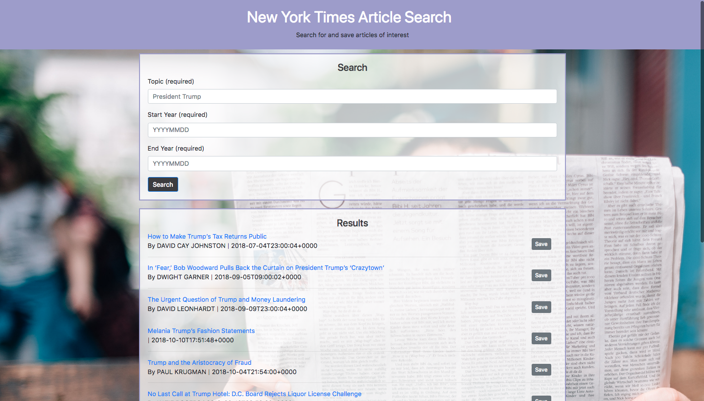

## NYT-React
The New York Times React app lets the user search the NYT api for any topic, start date, and end date. 10 articles are shown, the article headline, a link, the author, and publication date. The user can then save any of the articles and saved articles can then be deleted. 

______________
______________
______________
## Visit the deployed version of NYT-React
[NYT-React](https://whispering-castle-24337.herokuapp.com/)



______________
______________
______________

## Getting Started
to install locally run this command in your terminal
```
git clone https://github.com/oserenchenko/NYT-React.git
```
once inside the NYT-React folder, run
```
npm install
```
then cd into the client folder and run
```
npm install
```
then, start the server in the folder directory
```
node server.js
```
also run the react app in the client folder
```
yarn start
```
and the app should open automatically

## Built With

* HTML - website structure
* [CSS](https://css-tricks.com/) - styling
* [Bootstrap](https://getbootstrap.com/) - styling framework
* [Javascript](https://www.javascript.com/) - website logic
* [jQuery](https://jquery.com/) - manipulating the DOM
* [MongoDB/Mongoose](https://mongoosejs.com/) - database and object modeling
* [Node.js](https://nodejs.org/en/) - JS runtime
* [Express](https://expressjs.com/) - web framework for Node.js
* [React](https://reactjs.org/) - user interface
* [NYT api](https://developer.nytimes.com/) - NYT articles

______________
______________
______________
## Authors
* [Olga Serenchenko](https://github.com/oserenchenko)

______________
______________
______________
## License
This project is licensed under the MIT License - see the [LICENSE.md](LICENSE.md) file for details
